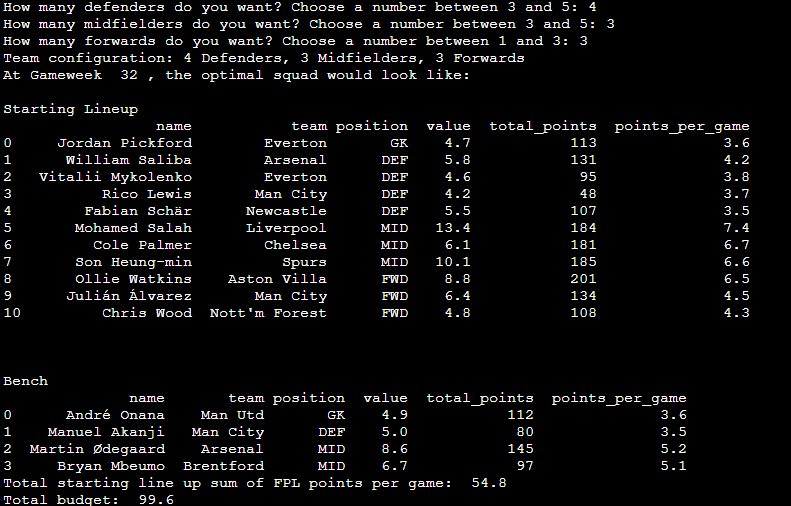
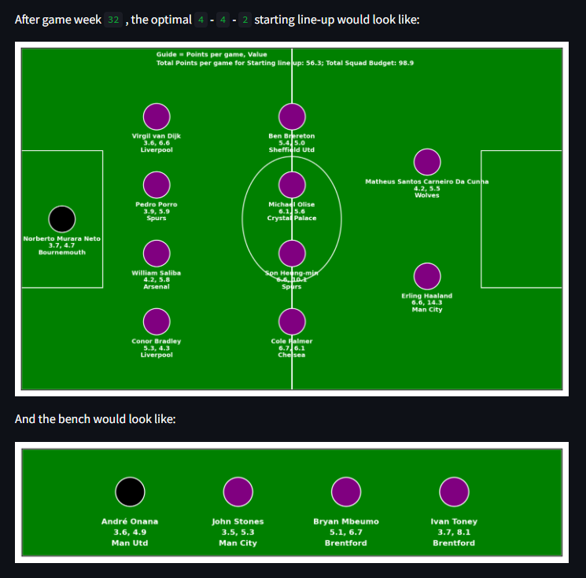

# FPL Team Optimization

#### Authors: Mubarak Ganiyu and Farouk Haroun

## Project Overview
The Fantasy Premier League [[5]](#5) is one of the most competitive fan-based online sporting events in the world. It attracts people from all nations as they compete to see who can rack up the most FPL points through the Premier League season. FPL points are points awarded to Premier League players over the course of the season based on their weekly performance. When someone signs up to play FPL, they are often prompted to build a squad that comprises of football players in the Premier League. As the season goes on, the players' awarded FPL points will be reflected on your squad. Therefore, you need to select a very poweerful squad when building your FPL team. Squad selection comes with certain constraints. You must select exactly 2 goalkeepers, 5 defenders, 5 midfielders and 3 forwards. Your squad budget must not exceed 100 million pounds. No team should have more than 3 players represented in your squad. Given all these information about the FPL and its constraints, we thought it would be great to leverage the power of quantum optimization to assist newcomers (especially those who are confused) with selecting the most optimal squad. This would be a case where the total FPL points per game is maximized while meeting the constraints. Thus, the FPL Team Optimization project was conceived. By gaining inspiration from a similar project [[2]](#2) conducted by SPDtek [[4]](#4), we were able to build an optimization algorithm that would assist FPL users with selecting the optimal squad when beginning their FPL journey for the season. 

## Usage 

### Prerequisites
- Python
- D-Wave Ocean SDK
- Pandas (for data manipulation)
- Environment Setup

### Terminal

#### D-Wave's GitHub Codespace

If you are going to run the code on D-Wave's GitHub Codespace, just type in the following command below:

      python squad_selection.py

#### Local Machine

If you are going to run the code on your local machine, make sure to adhere to the following steps:
- Fork this repository
- Use the following command in your local terminal to clone the repo:

      git clone https://github.com/your-github-username/fpl_team_optimization.git
  
- Use the next command to navigate to the folder where the code is stored:
  
      cd fpl_team_optimization
  
- Install all the required packages for making the code functional by running the command below:

      pip install -r requirements.txt
- Open the squad_selection.py file and uncomment the two lines of code below in the file while replacing the [INSERT TOKEN HERE] with your D-Wave API token which can be obtained [here](https://cloud.dwavesys.com/leap/):

        #api_token = [INSERT TOKEN HERE]
        #sampler = LeapHybridSampler(token= api_token)
  
- Use the command below to run the python code for generating an FPL team:
  
      python squad_selection_local.py

**Note:** Upon running either squad_selection.py or squad_selection_local.py, you will be prompted to insert the number of defenders, midfielders and forwards you would like to see in your starting line up for your squad. Make sure all the numbers you input are within the range and they sum up to 10. Or else, you will be prompted to re-insert them. 

#### Results
After running the code and specifying the number of defenders, midfielders and forwards you want, you will receive an output like the one below:

The starting line up would comprise of the players with the highest ratings in the optimized squad solution that the D-Wave LeapHybridSampler provides us with while the bench would include the remaining players that made it to the optimized squad.

### Web Application

Users can also navigate to the app [here](https://fpl-team-optimization.streamlit.app/) and follow instructions on the web app to generate an output that looks like the one below:

The app was built via Streamlit, a data science Python package for developing apps suitable for data visualization and other data science related projects.

## Data

The three datasets being used for this project are obtained in their rawest format from Vaastav's Fantasy Premier League GitHub repo [[1]](#1). The first dataset reflects all the gameweek information for all the players from the first gameweek to the most recent gameweek. The gameweek dataset focuses on metrics such as the position, the game week info and the name of the player. The second dataset reflects all the team information about various players with regards to their form, injuries and chances of playing next round. The third dataset is used to extract information about the players' most recent value. By combining all three datasets and wrangling them, it was possible to build a condensed dataset that focused on important variables such as name, team, total_points, date, position, gameweek, minutes played and FPL points per game. This condensed dataset reflects the top 50 highest rated players (5 goalkeepers, 15 defenders, 15 midfielders and 15 forwards) based on FPL points per game so far this season in terms of their most recent FPL points per game over season. For a player to be considered for selection, they must be available for the next gameweek (i.e. no injured or suspended or loaned players). Using GitHub Actions, the condensed dataset is updated everyday to reflect Premier League players' most recent performance, so that new users can get the up-to-date optimized FPL team when they use the project's website [here](https://fpl-team-optimization.streamlit.app/) or they can do a git pull for the repo on their local machine prior to running the squad_selection_local.py file. 

## Problem Formulation

The problem was formulated to maximize the total FPL points per game of the squad while meeting various FPL constraints. Below are the objective and constraints in plain english:

**Objective**
- Maximize the FPL points per game

**Constraints**
- The creation of a 15 player squad
- The selection of 2 goalkeepers
- The selection of 5 defenders
- The selection of 5 midfielders
- The selection of 3 forwards
- A maximum budget of 100 million pounds
- A team representation of 3 players at maximum.

The code for each objective/constraint alongside other variables and constants is provided below:

#### Variables

      x = Array.create('x', shape=num_var, vartype='BINARY')
      s = Array.create('s', shape=slack_num + len(df_use["team"].unique()), vartype='BINARY')
      
The x variable object is storing each individual player as a variable from x[1] to x[50]. We have 50 of them because we are selecting the optimal squad from 50 players. The s variable object is stores all slack variable for for the budget and team representation constraints. The number of slack variables is dictated by how many teams are represented in the top 50 highest rated players.

#### Lagrange Multipliers

      lagrange = max(df_use["points_per_game"])*15
      lagrange_budget = max(df_use["value"])*15
      lagrange_team = max(df_use["points_per_game"])*3

Three different lagrange multipliers were used. The first lagrange multiplier is for the squad. The second one is for the budget constraint. And the last one is for the team representation constraint.

#### Objective

The objective function is formulated as code below:

      h = sum(n * x for x, n in zip(x, total_points))

In the code above, n represents the FPL points per game for and x represents each players' binary variable. If a player is selected, x will be 1 for that player else it is 0. 

Mathematically, it can be expressed as:

$$h = \sum_{i=1}^{50} x_i \cdot n_i$$

#### 15 player squad creation

      c1 = lagrange * Constraint((sum(x[n] for n in range(0, num_var)) - 15)**2, 
                                  label='15 players squad')

$$c1 = \lambda*\sum_{i=1}^{50} (x_i - 15)^2$$

The dataset is ordered according to the position of the players, so the first 15 observations belong to defenders, the next 15 forwards, the next 5 goalkeepers and the final 15 midfielders.

#### 5 defenders' selection

      c2 = lagrange * Constraint((sum(x[n] for n in range(min(defense_list_index), max(defense_list_index)+1))-5)**2, 
                                  label=str(5) + " defenders")

$$c2 = \lambda*\sum_{i=1}^{15} (x_i - 5)^2$$

#### 3 forwards' selection

      c3 = lagrange * Constraint((sum(x[n] for n in range(min(forward_list_index), max(forward_list_index)+1))-3)**2,
                                  label=str(3) + " forwards")

$$c3 = \lambda*\sum_{i=16}^{30} (x_i - 3)^2$$

#### 2 goalkeepers' selection

      c4 = lagrange * Constraint((sum(x[n] for n in range(min(gk_list_index), max(gk_list_index)+1))-2)**2, 
                                  label= "2 keepers")

$$c4 = \lambda*\sum_{i=31}^{35} (x_i - 2)^2$$

#### 5 midfielders' selection

      c5 = lagrange * Constraint((sum(x[n] for n in range(min(midfield_list_index), max(midfield_list_index)+1))-5)**2, 
                                  label=str(5) + " midfielders")

$$c5 = \lambda*\sum_{i=36}^{50} (x_i - 5)^2$$

#### Budgetary Constraint

      c6 = lagrange_budget * Constraint((sum(n * x for x, n in zip(x, value)) + s[0] -100)**2, 
                                         label="budget")

$$c6 = \lambda_{budget} * \left(\sum_{i=1}^{50} x_i*n_i + s_1 - 100\right)^2$$

#### Team Representation Constraint

      c7 = 0

      for i in range(len(team_list)):
          use_index =list(df_use[df_use["team"]==team_list[i]].index)
          c7 += lagrange_team * Constraint((sum(x[n] for n in use_index) + s[i+1] - 3)**2, 
                                            label = str(team_list[i]) + " selection")

The team representation constraint involved going through the list of the 50 players and extracting all the players from the same team in order to develop a constraint where each team's maximum representation would be 3 players. It can be formulated mathematically as follows:

$$c7 = \sum_{t=1}^{T} \left(\lambda_{team} * \left(\sum_{i=1}^{t_s} x_i + s_{t+1} - 3 \right)^2\right)$$

The formulation is designed to iterate through each team up until the final team. $T$ here represents the total number of teams and the $t_s$ symbol represents the size of the team when computing the representation for each team. We use $s_{t+1}$ to denote the fact that we are starting from the second slack variable and beyond. We already used the first slack variable for budgetary constraint. 

#### Putting it all together

After developing the objective function and the constraints, they were combined together to create the problem hamiltonian.

      H = -1 * h + c1 + c2 + c3 + c4 + c5 + c6 + c7
      
$$H = -1*h + c1 + c2 + c3 + c4 + c5 + c6 + c7$$

Then, the problem hamiltonian was compiled and converted into a Binary Quadratic Model which the D-Wave's LeapHybridSampler used to obtain a solution for creating an optimized squad.

      model = H.compile()
      bqm = model.to_bqm()
      sampler = LeapHybridSampler()
      sampleset = sampler.sample(bqm,
                          label="FPL Team optimization")

## References
<a name="1">[1]</a> Vaastav Anand, "Fantasy Premier League," GitHub. Available: https://github.com/vaastav/Fantasy-Premier-League. Accessed: April 13, 2024.

<a name="2">[2]</a> Spdtek, "Line-up Optimization," GitHub. Available: https://github.com/spdtek/Line-up-optimization. Accessed: April 13, 2024.

<a name="3">[3]</a> T. Kumar, S. Singh, and A. Sharma, "Line-up Optimization for Fantasy Sports," arXiv:2112.13668, Dec. 2021. [Online]. Available: https://arxiv.org/ftp/arxiv/papers/2112/2112.13668.pdf. Accessed: April 13, 2024.

<a name="4">[4]</a> SPDTEK, "Home - SPDTEK," SPDTEK. Available: https://www.spdtek.com/home-spdtek. 

<a name="5">[5]</a> Premier League, "Fantasy Premier League," Premier League. Available: https://fantasy.premierleague.com/. Accessed: April 14, 2024.

<a name="6">[6]</a> D-Wave Systems Inc., "D-Wave Documentation Handbook," D-Wave Systems. Available: https://docs.dwavesys.com/docs/latest/doc_handbook.html. Accessed: April 13, 2024.

## License

Released under the Apache License 2.0. See [LICENSE](LICENSE) file.
